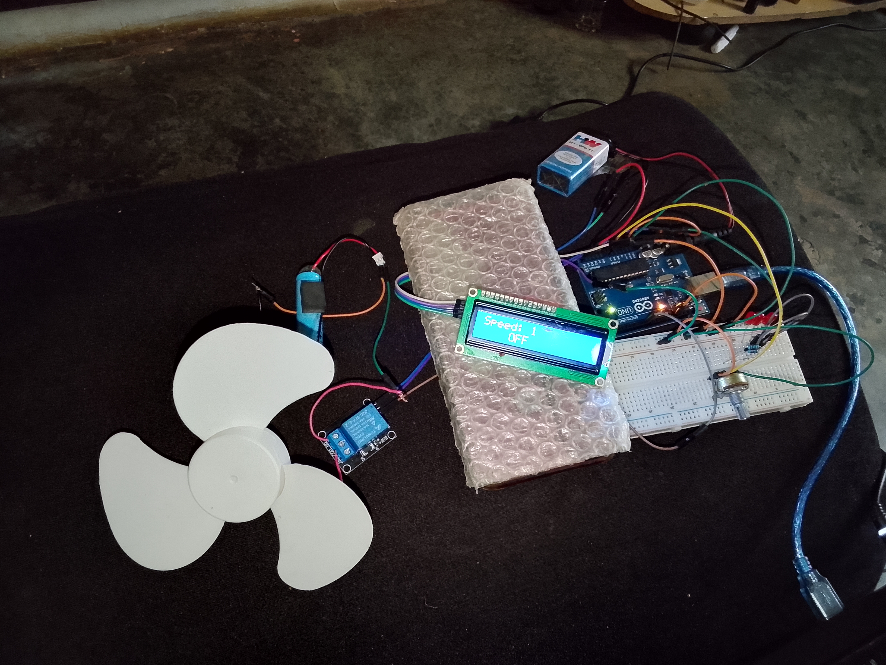

# LCD_Based_Smart_Fan_Regulation_System

A simple Arduino-based smart fan regulation system that uses a potentiometer to control fan speed levels and displays the current status on an I2C LCD screen.

This project simulates fan speed regulation using a relay module and manual analog input control.

---

## Components Used

- Arduino UNO
- 16x2 I2C LCD
- Potentiometer
- Relay Module
- Fan / DC Load
- Jumper Wires
- Breadboard

---

## Project Idea

The system reads the potentiometer value continuously.

Depending on the potentiometer position:

- LOW value → Fan OFF
- MID value → LOW speed mode
- HIGH value → HIGH speed mode

The LCD displays the current fan status in real time.

The relay switches the fan ON and OFF based on the selected speed level.

---

## Features

- Real-time LCD display
- Potentiometer-based control
- Fan ON/OFF regulation
- LOW and HIGH speed simulation
- Simple embedded systems project
- Beginner-friendly Arduino project

---

## images of project

[Click Here for Other Images](Images)
## Arduino Code

##Demo Video
[Click this link to get the Demo Video for the project](Videos/LCD_Based_Smart_Fan_Regulation_System_video.mp4)
